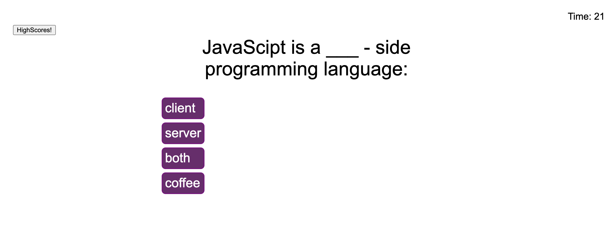
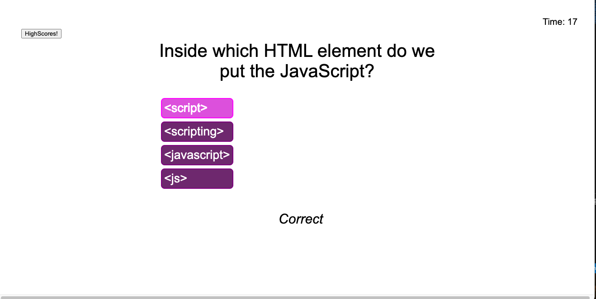
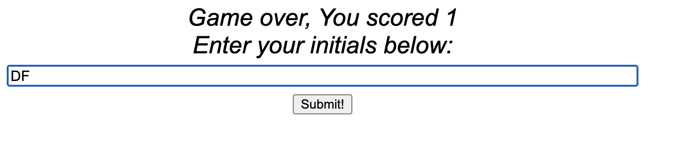

# quiz-me

## Description

Test your knowledge of JavaScript with this timed quiz. Users will have 30 seconds to answer as many questions as they can! At the end of the quiz users can enter their initials to submit their highscore. Users will also be able to view their highscores and beat their score or other users score.

Test yourself with [Quiz-Me: JavaScript Edition!](https://disantoz.github.io/quiz-me/)! 

## Usage

The Quiz will begin with the first question displayed, a list of choices, a timer on the top right and a button that redurects you to the highscore list:

Depending on the choice the user selects, it will display if the user was _correct_ or *incorrect*:

At the end of the quiz, the users score will be displayed, along with a text box that will enable the user to enter their initials and record their name to the leader board:

Users can then click on the highscore button in the beginning of the quiz to view their past scores!

## License

MIT License

Copyright (c) [2021] [DiSantoz]

Permission is hereby granted, free of charge, to any person obtaining a copy
of this software and associated documentation files (the "Software"), to deal
in the Software without restriction, including without limitation the rights
to use, copy, modify, merge, publish, distribute, sublicense, and/or sell
copies of the Software, and to permit persons to whom the Software is
furnished to do so, subject to the following conditions:

The above copyright notice and this permission notice shall be included in all
copies or substantial portions of the Software.

THE SOFTWARE IS PROVIDED "AS IS", WITHOUT WARRANTY OF ANY KIND, EXPRESS OR
IMPLIED, INCLUDING BUT NOT LIMITED TO THE WARRANTIES OF MERCHANTABILITY,
FITNESS FOR A PARTICULAR PURPOSE AND NONINFRINGEMENT. IN NO EVENT SHALL THE
AUTHORS OR COPYRIGHT HOLDERS BE LIABLE FOR ANY CLAIM, DAMAGES OR OTHER
LIABILITY, WHETHER IN AN ACTION OF CONTRACT, TORT OR OTHERWISE, ARISING FROM,
OUT OF OR IN CONNECTION WITH THE SOFTWARE OR THE USE OR OTHER DEALINGS IN THE
SOFTWARE.